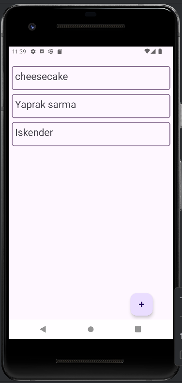
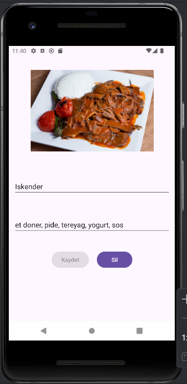

# 🍽️ Yemek Kitabı - Android Recipe Manager

Android yemek tarifi uygulaması. Kullanıcılar yemek tarifleri ekleyebilir, düzenleyebilir ve silebilir.

[](https://developer.android.com/)
[](https://kotlinlang.org/)
[](https://developer.android.com/training/data-storage/room)

## 📱 Ekran Görüntüleri

<p align="center">
  
  
</p>

## 🚀 Özellikler

- ✅ Yemek tarifi ekleme
- ✅ Tarif düzenleme ve silme
- ✅ Galeriden görsel seçme
- ✅ Room Database ile yerel depolama
- ✅ RecyclerView ile liste görünümü
- ✅ Navigation Component ile ekranlar arası geçiş
- ✅ RxJava3 ile asenkron işlemler
- ✅ İzin yönetimi (Gallery access)
- ✅ Görsel sıkıştırma ve optimizasyon

## 🛠️ Kullanılan Teknolojiler

### Diller
- **Kotlin** - Ana programlama dili

### Kütüphaneler ve Framework'ler
- **Room Database** - Yerel veritabanı (SQLite ORM)
- **RxJava3** - Asenkron işlemler ve reactive programming
- **Navigation Component** - Fragment yönetimi ve ekran geçişleri
- **View Binding** - Type-safe view erişimi
- **Material Design Components** - Modern UI bileşenleri
- **Activity Result API** - İzin ve galeri işlemleri

### Mimari
- MVVM benzeri mimari
- Repository pattern
- DAO (Data Access Object) pattern

## 📦 Proje Yapısı
```
app/
├── adapter/           # RecyclerView adaptörleri
│   └── TarifAdapter.kt
├── model/             # Data class'lar
│   └── Tarif.kt
├── roomdb/            # Room Database
│   ├── TarifDAO.kt
│   └── TarifDatabase.kt
└── view/              # Fragment'lar ve Activity
    ├── MainActivity.kt
    ├── ListeFragment.kt
    └── TarifFragment.kt
```

## 📚 Öğrendiklerim

Bu proje geliştirirken:
- ✅ Room Database ile CRUD işlemleri
- ✅ RxJava3 ile asenkron programlama
- ✅ Navigation Component kullanımı
- ✅ Activity Result API ile izin yönetimi
- ✅ Bitmap işleme ve optimizasyon
- ✅ ViewBinding kullanımı
- ✅ RecyclerView ve Adapter pattern

